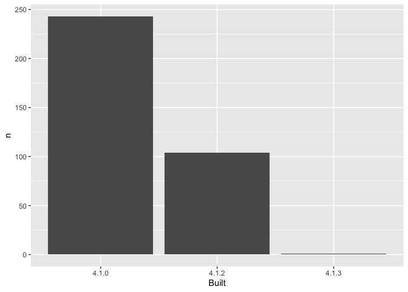

03_make-barchart.R
================
Jenny Bryan
2022-07-26

``` r
library(tidyverse)
```

    ## ── Attaching packages ─────────────────────────────────────── tidyverse 1.3.1 ──

    ## ✔ ggplot2 3.3.6           ✔ purrr   0.3.4      
    ## ✔ tibble  3.1.7           ✔ dplyr   1.0.99.9000
    ## ✔ tidyr   1.2.0           ✔ stringr 1.4.0.9000 
    ## ✔ readr   2.1.2.9000      ✔ forcats 0.5.1

    ## ── Conflicts ────────────────────────────────────────── tidyverse_conflicts() ──
    ## ✖ dplyr::filter() masks stats::filter()
    ## ✖ dplyr::lag()    masks stats::lag()

``` r
library(fs)

freqtable_file <- dir_ls(glob = "*freqtable.csv")
stopifnot(length(freqtable_file) == 1)

apt_freqtable <- read_csv(freqtable_file)
```

    ## Rows: 3 Columns: 3

    ## ── Column specification ────────────────────────────────────────────────────────
    ## Delimiter: ","
    ## chr (1): Built
    ## dbl (2): n, prop
    ## 
    ## ℹ Use `spec()` to retrieve the full column specification for this data.
    ## ℹ Specify the column types or set `show_col_types = FALSE` to quiet this message.

``` r
## apt_freqtable

p <- ggplot(apt_freqtable, aes(x = Built, y = n)) +
  geom_col()

p
```

<!-- -->

``` r
#ggsave(here("figs", "built-barchart.png"), p, height = 3)
```
